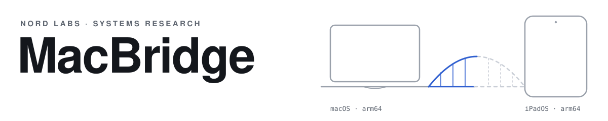
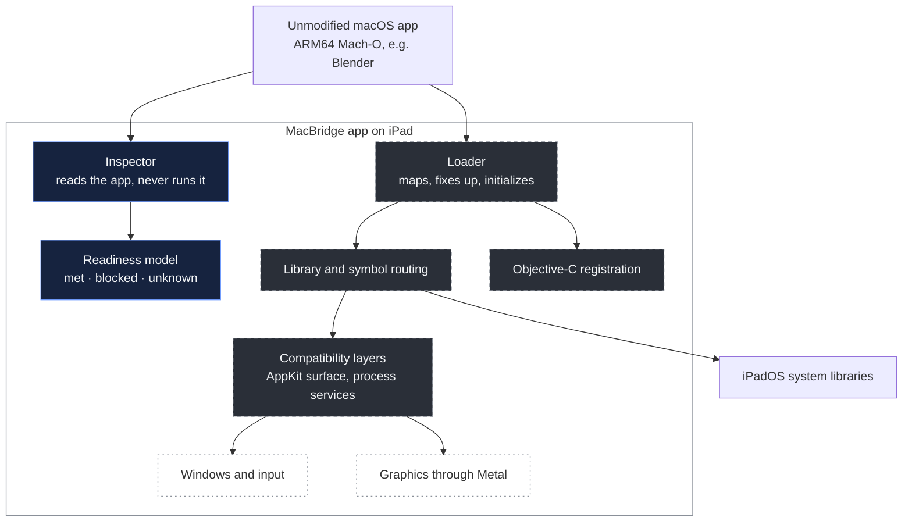
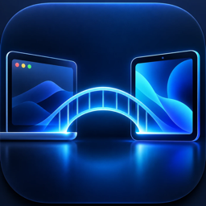

  <picture>
    <source media="(prefers-color-scheme: dark)" srcset="media/hero-dark.svg">
    <source media="(prefers-color-scheme: light)" srcset="media/hero-light.svg">
    
  </picture>

<h3 align="center">Mac software. iPad hardware. Exploring the space between.</h3>

  <a href="docs/introduction.md">Introduction</a> &nbsp;·&nbsp;
  <a href="STATUS.md">Status</a> &nbsp;·&nbsp;
  <a href="ROADMAP.md">Roadmap</a> &nbsp;·&nbsp;
  <a href="docs/README.md">Documentation</a> &nbsp;·&nbsp;
  <a href="docs/faq.md">FAQ</a>

 

MacBridge is independent systems research into whether unmodified ARM64 macOS applications could one day
run locally on an Apple Silicon iPad, through an original compatibility layer instead of streaming, a
remote Mac or a recompiled port. Today it inspects macOS software and measures, one piece at a time, what
running it would take.

> [!IMPORTANT]
> **No macOS application has been shown running through MacBridge on an iPad, and Blender does not run
> through MacBridge on any device.** What has run is MacBridge's own small test library (see First Contact
> below). Every result on this page names the environment it was measured in.

 

## The idea

An iPad Air or iPad Pro is built on the same family of Apple Silicon chips as a Mac. Both run 64-bit ARM
code; a small C program compiled for macOS and for iPadOS comes out as the same instruction sequence. Yet a Mac
app cannot be installed on an iPad. What separates them is software: different system libraries, a
different windowing system, different rules for how code is loaded and signed.

That makes the gap interesting to study. With the same processor on both sides, there is no instruction
translation in the way. The problem moves up into the operating system, into the loader, the system
libraries, Objective-C, windows, input and graphics. Each of those layers can be examined, measured and,
in principle, provided by a compatibility layer that stays within the platform's rules. Whether that is
achievable on a stock iPad is the open question. MacBridge exists to answer it with evidence, whichever way
the answer goes.

**MacBridge is not** a remote desktop, a stream from a Mac in the cloud, a virtual machine running macOS, a
recompiled port, or a jailbreak. It does not bypass code signing, the sandbox or any other platform
security ([SECURITY.md](SECURITY.md)).

 

## First Contact

<table>
  <tr>
    <td>
      <b>2026-10-10 · Physical iPad Air (M3), iPadOS 27.0</b>  
      MacBridge's experimental loader ran <b>its own ARM64 test library, built for macOS</b>, on a physical
      Apple Silicon iPad. It registered the library's code signature with the system, placed the code in
      memory, connected every pointer and import with zero differences from its model, ran the library's
      start-up code and called its functions: <code>42 · 30 · 6 · 8 · 1</code>, exactly as designed.
      Apple's own loader refuses the same file as "incompatible platform". Thread-local variables also
      worked through MacBridge's ARM64 entry code, its first run on Apple hardware. Each measurement was
      run twice.  
      <b>The limits are part of the result.</b> The test code was tiny, written by NORD LABS, and signed by
      the same developer team as the app, which was a development build. No standalone macOS program, no
      AppKit, no Blender, no other developer's code and no App Store or TestFlight build has run. No
      protection was disabled or worked around: the system's signature registration and library-validation
      checks were asked for and accepted the library, in this configuration.  
      <a href="docs/research/first-contact.md">Read the First Contact report →</a>
    </td>
  </tr>
</table>

 

## Where things stand

● measured &nbsp; ◐ experimental or partial &nbsp; ○ not yet demonstrated. Full detail in <a href="STATUS.md">STATUS.md</a>.

<table>
  <tr><th align="left">&nbsp;</th><th align="left">Result</th><th align="left">Shown on</th></tr>
  <tr><td>●</td><td>MacBridge inspector app installed and used</td><td>Physical iPad Air (M3), iPadOS 27.0</td></tr>
  <tr><td>●</td><td>Inspection of macOS apps: Mach-O, bundles, signatures, entitlements, dependencies</td><td>Mac command line and the iPad app</td></tr>
  <tr><td>◐</td><td>MacBridge's own test libraries mapped, linked, initialized and called by MacBridge's research loader</td><td>Intel Mac (x86_64 builds); physical iPad (ARM64, single libraries, development build)</td></tr>
  <tr><td>●</td><td>MacBridge's own ARM64 test library <em>built for macOS</em> run on an iPad by MacBridge's loader; Apple's loader refuses it</td><td>Physical iPad Air (M3), iPadOS 27.0, development signing, same-team signature</td></tr>
  <tr><td>●</td><td>Blender 5.2.2 (ARM64) analysed statically: every image, library link and imported system symbol</td><td>Static analysis</td></tr>
  <tr><td>●</td><td>Blender's official build run normally, as a reference for what MacBridge must one day reproduce</td><td>Apple Silicon CI runner and Intel Mac, Apple's own loader, <em>not</em> MacBridge</td></tr>
  <tr><td>◐</td><td>Experimental load surface: the 47 macOS definitions, mostly AppKit's, that Blender needs just to load</td><td>Own test programs, Intel Mac and x86_64 iOS Simulator</td></tr>
  <tr><td>●</td><td>Objective-C classes of MacBridge's own macOS-built test library registered, and their methods run, by MacBridge's loader</td><td>Physical iPad Air (M3), iPadOS 27.0, development signing, run twice</td></tr>
  <tr><td>●</td><td>Capability probe for the iPad: memory, file limits, Apple's loader, MacBridge's loader on its own signed test code</td><td>Physical iPad Air (M3), iPadOS 27.0, run twice</td></tr>
  <tr><td>○</td><td>A standalone macOS program, AppKit code, or any macOS application through MacBridge on an iPad</td><td><strong>Not demonstrated</strong></td></tr>
  <tr><td>○</td><td>Blender running through MacBridge</td><td><strong>Not demonstrated</strong>, on any device</td></tr>
</table>

 

## What has been built

| Part | What exists today |
|---|---|
| **Inspector** | Reads macOS apps without running them: thin and universal Mach-O, load commands, code signatures, entitlements, nested helpers. Runs on the Mac and inside the iPad app. |
| **Dependency analysis** | The full graph of bundled and system libraries. For a headless Blender start: 26 macOS system libraries, each mapped to an iPadOS library, a stand-in, or a recorded conflict. |
| **Symbol routing** | A provider for each of the 1,453 system symbols a headless start imports: 1,368 exist on iPadOS by name, 46 would come from MacBridge, 38 are unresolved lazy functions, and 1, `NSColor`, is an open conflict with UIKit. |
| **Fixup decoding** | Agrees exactly with LLVM's `llvm-objdump` on all 195 of Blender's images that carry fixups, about 1.2 million of them. |
| **Objective-C research** | Blender's own classes parsed and checked against Apple's tools. MacBridge's own test classes registered through the documented runtime API on an Intel Mac; a name that already exists is refused, not replaced. |
| **Load surface** | The 47 definitions Blender needs just to *load*, 39 of them from AppKit. Removing each in turn stopped loading (44 of 44 cases, Intel Mac and x86_64 simulator). Structure, not an implementation of AppKit. |
| **Research loader** | On an Intel Mac, maps MacBridge's own test libraries, applies fixups, coalesces weak symbols, sets up thread-local variables, registers Objective-C classes, runs initializers and calls functions. Memory after fixups matches the model byte for byte. On a physical iPad, the same work for single own ARM64 libraries (iOS-built and macOS-built) and thread-local variables, under development signing. Not yet Objective-C or several libraries on the iPad, never on Blender. |
| **Original fixtures** | Small C, C++ and Objective-C programs written for MacBridge, each built so that one result depends on one loader step. No Apple or Blender code is redistributed. |

Each of these is explained, with its evidence and limits, in [Architecture](docs/architecture.md).

 

## Blender, the North Star

The long-term goal is to run the **official, unmodified ARM64 macOS build of Blender locally on an Apple
Silicon iPad**. It is a direction for the research, not a feature.

- **It is open source.** Its behaviour can be studied in the open, and the official build is freely available.
- **It is ARM64-native.** No x86 translation is involved, so the work stays focused on the operating system.
- **It is demanding.** One application exercises nearly everything a compatibility layer must provide:
  files, heavy multithreading, an embedded Python interpreter, windows, input and GPU rendering through Metal.
- **It is measurable.** Blender either starts, runs Python, renders and saves, or it doesn't.

<table>
  <tr><th align="left">&nbsp;</th><th align="left">Milestone on a physical iPad</th><th align="left">What would prove it</th></tr>
  <tr><td>◐</td><td>Readiness research</td><td>Every requirement of a headless start mapped to a measured answer or a named blocker</td></tr>
  <tr><td>○</td><td>First startup</td><td>Blender's own code begins executing; <code>--version</code> prints</td></tr>
  <tr><td>○</td><td>Python</td><td><code>--background</code> starts and runs a Python script</td></tr>
  <tr><td>○</td><td>Files</td><td>A <code>.blend</code> file opens and saves</td></tr>
  <tr><td>○</td><td>CPU rendering</td><td>Cycles renders on the CPU and writes an image</td></tr>
  <tr><td>○</td><td>Interface</td><td>The Blender window opens and accepts input</td></tr>
  <tr><td>○</td><td>3D viewport</td><td>The viewport draws and responds</td></tr>
  <tr><td>○</td><td>Metal</td><td>GPU drawing and rendering through the iPad's GPU</td></tr>
</table>

Each stage has to be shown on its own. Reaching one does not imply the next. How Blender is being studied,
and what was found: [Blender research](docs/research/blender.md).

 

## Proof over promises

Every result in MacBridge carries a status (PASS, PARTIAL, FAIL, BLOCKED, UNKNOWN or NOT TESTED), the
environment it came from, and how it was established: measured, known from documentation or source, or
inferred. A few rules keep that honest:

- A Mac result is not an iPad result.
- A simulator result is not a physical-device result.
- Static analysis is not execution, and a symbol that exists is not a symbol that behaves the same.
- MacBridge's own test program running is not Blender running.
- A precise failure ("blocked by X, at step Y, on build Z") is a result worth publishing.

Corrections happen in the open. One example: an early analysis said Blender subclasses `NSWorkspace`;
checking with a second tool showed `NSWindow`, `NSView` and `NSOpenGLView`, and the record was fixed.
Every correction so far is listed in [How results are established](docs/evidence.md#corrections).

 

## Architecture

The intended design is a userspace runtime inside one ordinary iPad app: no virtual machine, no second
operating system. The diagram shows the major parts and how far each has come.

<b>Navy, solid</b>: built and tested, including on iPad. <b>Graphite, dashed</b>: research code and
models validated on a Mac or statically; the loader has also run MacBridge's own test libraries on an iPad.
<b>Outline only</b>: planned. Subsystem by
subsystem: <a href="docs/architecture.md">Architecture</a>.

 

## Roadmap

| | Phase | Status |
|---|---|---|
| 0–1 | Foundations · Inspection | **Complete**, inspector tested on a physical iPad |
| 2 | Static compatibility mapping for Blender 5.2.2 | **Active**, nearly complete |
| 3–4 | Original compatibility components · Host execution research | **Experimental**, Mac and simulator; loader steps also on the iPad |
| 5 | Physical-iPad feasibility (DeviceProbe) | **Active**, first positive measurements: own same-team-signed libraries run under development signing |
| 6 | First original ARM64 macOS program on an iPad | **Active**, a macOS-built test *library* has run; a standalone program has not |
| 7–8 | Headless runtime · Blender headless | Not started |
| 9–11 | Windows and input · Metal · Usability | Not started |

Phase 5 is a gate: its answer decides whether everything after it is possible on a stock iPad. First
Contact opened it for MacBridge's own code; code signed by other developers and distribution builds are
still open. No dates
and no percentages; each phase ends with a recorded result, positive or negative. Definitions of done,
dependencies and risks: [ROADMAP.md](ROADMAP.md).

 

## Go deeper

| For | Read |
|---|---|
| New here | [Introduction](docs/introduction.md) · [How it works, in plain language](docs/how-it-works.md) · [FAQ](docs/faq.md) |
| Engineers | [Technical concepts](docs/concepts.md) · [Architecture](docs/architecture.md) · [The experimental loader](docs/research/loader.md) · [Objective-C](docs/research/objective-c.md) · [DeviceProbe](docs/research/device-probe.md) |
| Evidence | [Status](STATUS.md) · [How results are established](docs/evidence.md) · [Verified facts](docs/facts.md) · [Research journal](docs/journal.md) |
| Everything | [Documentation index](docs/README.md) · [Glossary](docs/glossary.md) |

The implementation lives in a separate private NORD LABS repository. Findings that are safe to publish
land here. Questions and corrections are welcome: see [CONTRIBUTING.md](CONTRIBUTING.md).

 

## About

MacBridge is an independent project led by **Théodore Beaupré** under **NORD LABS**. It grew out of a
simple observation: the iPad on the desk and the Mac beside it share the same kind of processor, yet what
each one can run is decided by something else.

The project is directed by its creator. Much of the implementation and research is done with AI coding
agents, and their work is held to the same rule as everything else here: it counts when it is backed by a
reproducible result, and not before.

MacBridge is not affiliated with, endorsed by, or supported by Apple Inc. or the Blender Foundation.

 

## License

This repository is **proprietary, source-available material. It is not open source.**
Copyright © 2026 Théodore Beaupré, operating as ISO NORD CA. All rights reserved.

You may view it on GitHub, review it for evaluation or security research, and propose contributions, which
are governed by the license's Contributions section. Without prior written permission you may not use,
copy, redistribute, modify or commercialize these materials, or use them to train or evaluate AI models.
GitHub's platform-level viewing and forking remain subject to GitHub's Terms of Service.

The complete terms are in [LICENSE.md](LICENSE.md) (ISO NORD CA Commercial & Source-Available License 1.0).
Licensing requests: info@theo-picture.com

 

---

  The hardware is already in people's hands. 
  MacBridge is an attempt to find out how much more it can do, 
  and to write down honestly what stands in the way.

  NORD LABS · Québec 
  macOS, iPadOS, iPad, Apple Silicon and Metal are trademarks of Apple Inc. Blender is a trademark of the Blender Foundation.

