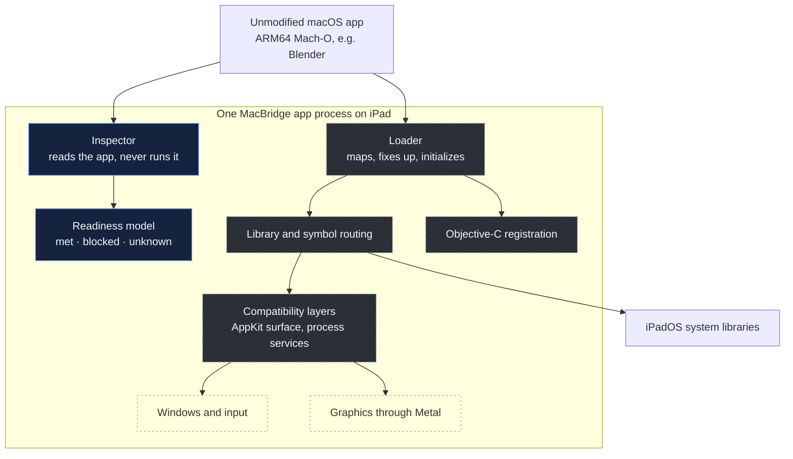

  <picture>
    <source media="(prefers-color-scheme: dark)" srcset="media/hero-dark.svg">
    <source media="(prefers-color-scheme: light)" srcset="media/hero-light.svg">
    
  </picture>

<h3 align="center">Mac software. iPad hardware. Exploring the space between.</h3>

  <a href="STATUS.md">Status</a> &nbsp;·&nbsp;
  <a href="ROADMAP.md">Roadmap</a> &nbsp;·&nbsp;
  <a href="#proof-over-promises">How results are proven</a> &nbsp;·&nbsp;
  <a href="SECURITY.md">Security</a> &nbsp;·&nbsp;
  <a href="LICENSE.md">License</a>

 

MacBridge is independent systems research into whether unmodified ARM64 macOS applications could one day
run locally on an Apple Silicon iPad, through an original compatibility layer instead of streaming, a
remote Mac or a recompiled port. Today it inspects macOS software and measures, one piece at a time, what
running it would take.

> [!IMPORTANT]
> **No macOS application has been shown running through MacBridge on an iPad, and Blender does not run
> through MacBridge on any device.** Every result on this page names the environment it was measured in.

 

## The idea

An iPad Air or iPad Pro is built on the same family of Apple Silicon chips as a Mac. Both run 64-bit ARM
code; a small C program compiled for macOS and for iPadOS produces the same machine instructions. Yet a Mac
app cannot be installed on an iPad. What separates them is software: different system libraries, a
different windowing system, different rules for how code is loaded and signed.

That makes the gap interesting to study. With the same processor on both sides, there is no instruction
translation in the way. The problem moves up into the operating system, into the loader, the system
libraries, Objective-C, windows, input and graphics. Each of those layers can be examined, measured and,
in principle, provided by a compatibility layer that stays within the platform's rules. Whether that is
achievable on a stock iPad is the open question. MacBridge exists to answer it with evidence, whichever way
the answer goes.

**MacBridge is not** a remote desktop, a stream from a Mac in the cloud, a virtual machine running macOS, a
recompiled port, or a jailbreak. It does not bypass code signing, the sandbox or any other platform
security ([SECURITY.md](SECURITY.md)).

 

## Where things stand

<table>
  <tr><th align="left">&nbsp;</th><th align="left">Result</th><th align="left">Shown on</th></tr>
  <tr><td>●</td><td>MacBridge inspector app installed and used</td><td>Physical iPad Air (M3), iPadOS 27.0</td></tr>
  <tr><td>●</td><td>Inspection of macOS apps: Mach-O, bundles, signatures, entitlements, dependencies</td><td>Mac command line and the iPad app</td></tr>
  <tr><td>●</td><td>MacBridge's own test libraries mapped, linked, initialized and called by MacBridge's research loader</td><td>Intel Mac, x86_64 builds</td></tr>
  <tr><td>●</td><td>Blender 5.2.2 (ARM64) analysed statically: every image, library link and imported system symbol</td><td>Static analysis</td></tr>
  <tr><td>●</td><td>Blender's official build run normally, as a reference for what MacBridge must one day reproduce</td><td>Apple Silicon Mac, Apple's own loader, <em>not</em> MacBridge</td></tr>
  <tr><td>◐</td><td>Experimental AppKit load surface: the definitions Blender needs just to load</td><td>Own test programs, Mac and iOS Simulator</td></tr>
  <tr><td>◐</td><td>Capability probe for the iPad (memory limits, what an app may map and run of its own signed code)</td><td>Built and installed; <strong>not yet run</strong></td></tr>
  <tr><td>○</td><td>Any macOS binary running through MacBridge on a physical iPad</td><td><strong>Not demonstrated</strong></td></tr>
  <tr><td>○</td><td>Blender running through MacBridge</td><td><strong>Not demonstrated</strong>, on any device</td></tr>
</table>

● measured &nbsp; ◐ experimental or partial &nbsp; ○ not yet demonstrated. Full detail in <a href="STATUS.md">STATUS.md</a>.

 

## What has been built

**Inspector.** Reads macOS apps without running them: thin and universal Mach-O files (arm64, arm64e,
x86_64), load commands, code signatures and entitlements, nested helpers and extensions. Runs on the Mac
and inside the iPad app.

**Dependency analysis.** Builds the full graph of bundled and system libraries. For a headless Blender
start that means 26 macOS system libraries, all strongly linked, each mapped to an iPadOS library, a
stand-in MacBridge would have to provide, or a recorded conflict.

**Symbol routing.** Each of the 1,453 system symbols a headless Blender start imports has an assigned
provider: 1,368 exist in iPadOS under the same name, 46 come from MacBridge's compatibility layer, 38 are
explicitly unresolved. One is a genuine conflict: UIKit already defines a class called `NSColor`. That
decision is recorded as open rather than quietly resolved.

**Fixup decoding.** Before code can run, every pointer in it has to be adjusted for where it was loaded.
MacBridge's decoder agrees exactly with LLVM's `llvm-objdump` on all 195 of Blender's images that carry
such fixups, about 1.2 million of them.

**Objective-C research.** Blender's own classes (subclasses of `NSWindow`, `NSView` and `NSOpenGLView`)
are parsed and checked against Apple's tools. Classes are registered through the documented Objective-C
runtime API, and a class name that already exists in the process is refused instead of silently replaced.

**Experimental AppKit shim.** Provides the 47 AppKit definitions Blender needs just to *load*. Every one is
necessary: removing any single definition stops loading. It is a structural surface, not an
implementation of AppKit.

**Original test fixtures.** Small C, C++ and Objective-C libraries written for MacBridge, each designed so
that one result depends on exactly one loader step. No Apple or Blender code is redistributed.

**Experimental loader.** On an Intel Mac, MacBridge maps its own test libraries into memory, applies their
fixups, coalesces weak symbols across libraries, sets up thread-local variables, registers Objective-C
classes, runs initializers and calls their functions. After fixups, memory matches the analysis model byte
for byte. This is research code for MacBridge's own fixtures; it has not run Blender, ARM64 code, or
anything on an iPad.

 

## Blender, the North Star

The long-term goal is to run the **official, unmodified ARM64 macOS build of Blender locally on an Apple
Silicon iPad**. It is a direction for the research, not a feature.

- **It is open source.** Its behaviour can be studied in the open, and the official build is freely available.
- **It is ARM64-native.** No x86 translation is involved, so the work stays focused on the operating system.
- **It is demanding.** One application exercises nearly everything a compatibility layer must provide:
  files, heavy multithreading, an embedded Python interpreter, windows, input and GPU rendering through Metal.
- **It is honest to measure.** Blender either starts, runs Python, renders and saves, or it doesn't.

<table>
  <tr><th align="left">&nbsp;</th><th align="left">Milestone on a physical iPad</th><th align="left">What would prove it</th></tr>
  <tr><td>◐</td><td>Readiness research</td><td>Every requirement of a headless start mapped to a measured answer or a named blocker</td></tr>
  <tr><td>○</td><td>First startup</td><td>Blender's own code begins executing; <code>--version</code> prints</td></tr>
  <tr><td>○</td><td>Python</td><td><code>--background</code> starts and runs a Python script</td></tr>
  <tr><td>○</td><td>Files</td><td>A <code>.blend</code> file opens and saves</td></tr>
  <tr><td>○</td><td>CPU rendering</td><td>Cycles renders on the CPU and writes an image</td></tr>
  <tr><td>○</td><td>Interface</td><td>The Blender window opens and accepts input</td></tr>
  <tr><td>○</td><td>3D viewport</td><td>The viewport draws and responds</td></tr>
  <tr><td>○</td><td>Metal</td><td>GPU drawing and rendering through the iPad's GPU</td></tr>
</table>

Each stage has to be shown on its own. Reaching one does not imply the next.

 

## Proof over promises

Every result in MacBridge carries a status (PASS, PARTIAL, FAIL, BLOCKED, UNKNOWN or NOT TESTED), the
environment it came from, and how it was established: measured, known from documentation or source, or
inferred. A few rules keep that honest:

- A Mac result is not an iPad result.
- A simulator result is not a physical-device result.
- Static analysis is not execution, and a symbol that exists is not a symbol that behaves the same.
- MacBridge's own test program running is not Blender running.
- A precise failure ("blocked by X, at step Y, on build Z") is a result worth publishing.

Corrections happen in the open. An early analysis said Blender subclasses `NSWorkspace`; checking again
showed `NSWindow`, `NSView` and `NSOpenGLView`, and the record was fixed. A test once passed an
initializer check without any initializer running, because the compiler had precomputed the value. The
fixture was rewritten so that the check can actually fail.

 

## Architecture

The intended design is a userspace runtime inside one ordinary iPad app: no virtual machine, no second
operating system. The diagram shows the major parts and how far each has come.

<b>Navy, solid</b>: built and tested, including on iPad. <b>Graphite, dashed</b>: research code and
models validated on a Mac or statically, not yet on an iPad. <b>Outline only</b>: planned.

 

## Roadmap

| | |
|---|---|
| **Completed** | Inspector on Mac and iPad · dependency graph · runtime capability model · Blender 5.2.2 static analysis · symbol and library routing · fixup decoding · reference runs of Blender on Macs |
| **Experimental** | Research loader for MacBridge's own fixtures (Mac only) · AppKit load surface · Objective-C registration · iPad capability probe (built, not yet run) |
| **Not yet demonstrated** | Any macOS code running through MacBridge on an iPad · Blender through MacBridge, at any stage |
| **Future** | Windows and input · Metal graphics · Blender's interface and viewport |

No dates and no percentages: each step ends when there is a recorded result, positive or negative. The
dependency-ordered plan is in [ROADMAP.md](ROADMAP.md).

 

## Go deeper

- [STATUS.md](STATUS.md): the current facts, what the measurements say, and the Blender readiness findings.
- [ROADMAP.md](ROADMAP.md): milestones in the order they depend on each other, with what "done" means for each.
- [SECURITY.md](SECURITY.md): the research boundaries the project will not cross.
- [Project history](https://github.com/NORD-LABS/MacBridge-Project/commits/main): each published finding, dated.

The implementation lives in a separate private NORD LABS repository. Findings that are safe to publish
land here.

 

## About

MacBridge is an independent project led by **Théodore Beaupré** under **NORD LABS**. It grew out of a
simple observation: the iPad on the desk and the Mac beside it share the same kind of processor, yet what
each one can run is decided by something else. Much of the engineering is done with AI coding agents,
held to the same evidence rules as everything else on this page.

MacBridge is not affiliated with, endorsed by, or supported by Apple Inc. or the Blender Foundation.

 

## License

This repository is **proprietary, source-available material. It is not open source.**
Copyright © 2026 Théodore Beaupré, operating as ISO NORD CA. All rights reserved.

You may view it on GitHub, review it for evaluation or security research, and propose contributions, which
are governed by the license's Contributions section. Without prior written permission you may not use,
copy, redistribute, modify or commercialize these materials, or use them to train or evaluate AI models.
GitHub's platform-level viewing and forking remain subject to GitHub's Terms of Service.

The complete terms are in [LICENSE.md](LICENSE.md) (ISO NORD CA Commercial & Source-Available License 1.0).
Licensing requests: info@theo-picture.com

 

---

  The hardware is already in people's hands. 
  MacBridge is an attempt to find out how much more it can do, 
  and to write down honestly what stands in the way.

  NORD LABS · Québec 
  macOS, iPadOS, iPad, Apple Silicon and Metal are trademarks of Apple Inc. Blender is a trademark of the Blender Foundation.

