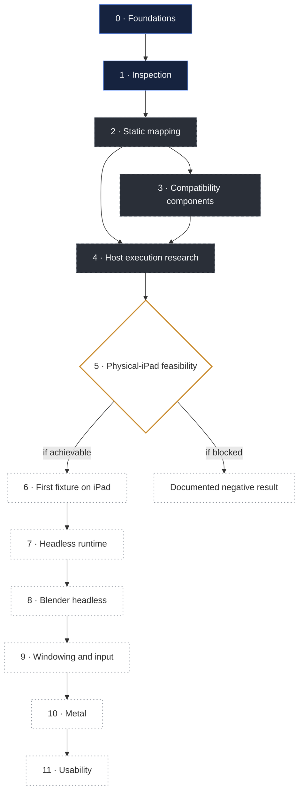

# MacBridge roadmap

This is a research plan, not a release schedule. It describes how MacBridge intends to get from where it is
to its long-term target, what each step must demonstrate, and what could stop it.

There are no dates and no percentages. A phase ends when its defining result has been recorded, positive or
negative. A precise "blocked by X" is a valid way for a phase to end.

**Contents:** [Vision](#vision) · [Status vocabulary](#status-vocabulary) · [At a glance](#at-a-glance) ·
[Dependencies](#dependencies) · [Phases](#phases) · [Research risks](#research-risks) ·
[Next sessions](#next-sessions)

---

## Vision

> Run the official, unmodified ARM64 macOS build of Blender locally on an Apple Silicon iPad, through an
> original userspace compatibility layer, within the platform's rules.

Blender is the North Star because it needs almost everything a Mac app can need. It is a direction for the
research. Reaching it is not assumed. See [Blender research](docs/research/blender.md).

## Status vocabulary

| Status | Meaning |
|---|---|
| **COMPLETE** | The phase's defining result is recorded. It means the *research milestone* is done, not that a product feature is supported. |
| **EXPERIMENTAL** | Working research code or models exist and pass their checks, but not yet in the environment that matters (usually a physical iPad). |
| **ACTIVE** | Current work. |
| **BLOCKED** | Cannot proceed. The obstacle is named. |
| **NOT STARTED** | No work yet, usually because an earlier phase must finish first. |
| **UNKNOWN** | Whether this phase is achievable at all depends on an unanswered question. |

## At a glance

| Phase | | Status |
|---|---|---|
| 0 | Research foundations | **COMPLETE** |
| 1 | Inspection | **COMPLETE**, including on a physical iPad |
| 2 | Static compatibility mapping | **ACTIVE**, nearly complete for Blender 5.2.2 headless |
| 3 | Original compatibility components | **EXPERIMENTAL**, Mac and simulator only |
| 4 | Host execution research | **EXPERIMENTAL**, Intel Mac only |
| 5 | Physical-iPad feasibility | **ACTIVE**, probe installed, not yet run |
| 6 | First ARM64 macOS fixture on an iPad | **NOT STARTED**, feasibility **UNKNOWN** |
| 7 | Headless runtime | NOT STARTED |
| 8 | Blender headless | NOT STARTED |
| 9 | Windowing and input | NOT STARTED, static mapping only |
| 10 | Metal | NOT STARTED |
| 11 | Usability and reliability | NOT STARTED |

## Dependencies

The phases are numbered in the order they are expected to happen, but they are not a straight line. Phase 5
is a gate: its answer decides whether phases 6 to 11 are possible on a stock iPad at all.

Navy: complete. Graphite, dashed: active or experimental. Amber: the gate. Dotted: not started.

Four tracks run alongside every phase:

- **Testing.** Every subsystem is checked against an independent reference (Apple's tools, LLVM, Apple's
  own loader running MacBridge's fixtures) before it is trusted.
- **Security.** No step may require bypassing a platform protection. If one does, it is recorded as blocked.
- **Evidence.** Every result names its environment, and results are never copied between environments.
- **Documentation.** Findings that are safe to publish land in this repository.

---

## Phases

### Phase 0 · Research foundations

| | |
|---|---|
| **Goal** | Define the question, the boundaries and the first architecture decisions. |
| **Status** | COMPLETE (2026-10-01) |
| **Result** | Native ARM64 first; no full virtual machine as the primary design; a userspace runtime inside one app; Apple's proprietary files never redistributed; no code imported from GPL projects. |

### Phase 1 · Inspection

| | |
|---|---|
| **Goal** | Understand macOS software without running it. |
| **Status** | COMPLETE. The inspector app was installed and used on a physical iPad Air (M3), iPadOS 27.0. |
| **Evidence required** | Inspector results on the Mac and on a physical iPad; tests over original fixtures. |
| **Success criteria** | Thin and universal Mach-O, load commands, signatures and entitlements, nested executables, bundles and dependency graphs are read correctly; a report explains its findings with reasons, never a score. |
| **Follow-up** | The reliability fixes found by fuzzing (2026-10-09) have to be built and tested on a Mac, then reach the app. |

### Phase 2 · Static compatibility mapping

| | |
|---|---|
| **Goal** | Know exactly what a headless start of Blender asks of the system, and who could answer each request on an iPad. |
| **Status** | ACTIVE, nearly complete for the canonical Blender 5.2.2 build. |
| **Done so far** | Canonical build identity; every library and symbol attributed; 1,453 imports routed; 26 system library links mapped; fixups decoded identically to LLVM; Objective-C classes parsed; process-state requests identified; per-capability preflight. |
| **Evidence required** | Each requirement either mapped to a measured answer or to a named blocker. |
| **Success criteria** | No requirement of a headless start remains unclassified. |
| **Open items** | The `NSColor` conflict needs an owner decision. Python resource experiments for the canonical build need an Apple Silicon Mac. |

### Phase 3 · Original compatibility components

| | |
|---|---|
| **Goal** | Build the smallest original pieces a Mac program needs just to load, and validate them with original fixtures. |
| **Status** | EXPERIMENTAL. |
| **Done so far** | A load surface for the 47 definitions Blender needs to load, validated on the Mac and in the simulator; an omission sweep shows each is required. |
| **Prerequisites** | Phase 2. |
| **Evidence required** | Own fixtures that load with the component and fail without it, on the Mac, in the simulator and, later, on the iPad. |
| **Success criteria** | The load-time surface works on a physical iPad with own fixtures. |
| **Blockers** | Phase 5. The `NSColor` decision. |

### Phase 4 · Host execution research

| | |
|---|---|
| **Goal** | Turn the checked models into a working loader, on a Mac, for MacBridge's own fixtures. |
| **Status** | EXPERIMENTAL. Done on an Intel Mac with x86_64 builds. |
| **Done so far** | Mapping, fixups (memory identical to the model), multi-library linking with weak coalescing, thread-local variables, Objective-C registration, initializers, calls. ARM64 thread-local entry code passes its contract under an emulator. |
| **Evidence required** | The same results with ARM64 builds on an Apple Silicon Mac. |
| **Success criteria** | The research loader runs every own fixture on ARM64 macOS, with memory matching the model. |
| **Blockers** | None technical. Needs an Apple Silicon Mac session. The cloud reliability fixes must first be built and tested on a Mac. |
| **Next experiment** | Build the research branch on a Mac; run the loader's test suite. |

### Phase 5 · Physical-iPad feasibility

| | |
|---|---|
| **Goal** | Measure what an iPad app may legitimately do with its own signed code, and whether MacBridge's loader can work within that. |
| **Status** | ACTIVE. DeviceProbe is built and installed on an iPad Air (M3); it has not run. |
| **Prerequisites** | Phase 4 on a Mac (the Intel results exist). |
| **Evidence required** | DeviceProbe's recorded results on a named iPad model and iPadOS build. |
| **Success criteria** | Each question has a measured answer: memory limit, file limit, executable-memory policy, system-loader control, MacBridge's loader on its own signed library. |
| **Blockers** | Needs the owner's Mac and an unlocked iPad. |
| **What it decides** | Whether phases 6 to 11 are possible on a stock iPad. See [DeviceProbe](docs/research/device-probe.md). |

### Phase 6 · First ARM64 macOS fixture on an iPad

| | |
|---|---|
| **Goal** | A small, original ARM64 macOS program runs on a physical iPad through MacBridge, with its output recorded. |
| **Status** | NOT STARTED. Feasibility UNKNOWN. |
| **Prerequisites** | Phase 5 shows a legitimate route. |
| **Evidence required** | Output captured on a named device and iPadOS build. |
| **Success criteria** | A "hello world", then programs that use files, threads and Foundation, run and exit cleanly. |
| **Main blocker** | Whether code built as a macOS program can legitimately become executable inside MacBridge's process. |

This would be the project's first major breakthrough. It is not assumed.

### Phase 7 · Headless runtime

| | |
|---|---|
| **Goal** | Give a loaded program the process it expects: arguments, environment, working directory, bundle, files, threads, time, resources. |
| **Status** | NOT STARTED. A model of the file layout exists. |
| **Prerequisites** | Phase 6. |
| **Success criteria** | Own fixtures that query their process, read and write files and run threads behave on the iPad as they do on the Mac. |
| **Main blocker** | The program shares MacBridge's process. Every answer about "the current process" has to be provided by MacBridge on the program's behalf. |

### Phase 8 · Blender headless

| | |
|---|---|
| **Goal** | The official Blender ARM64 build reaches its own code and does useful work without a window. |
| **Status** | NOT STARTED. |
| **Prerequisites** | Phase 7. |
| **Stages** | Each shown separately: `--version` prints · a Python script runs · a `.blend` file opens and saves · Cycles renders on the CPU and writes an image. |
| **Evidence required** | Each stage on a named device and build, compared with the Mac reference runs. |
| **Main blockers** | Memory; Python's native modules loaded at run time; thousands of initializers; Blender's own code signature. |

### Phase 9 · Windowing and input

| | |
|---|---|
| **Goal** | A Mac window becomes something on the iPad screen; touch, keyboard and trackpad become the events a Mac app expects. |
| **Status** | NOT STARTED. Blender's windowing and input requirements are mapped on paper. |
| **Prerequisites** | Phase 8. |
| **Main blocker** | AppKit's behaviour, not just its structure, would have to exist. This is a large surface. |

### Phase 10 · Metal

| | |
|---|---|
| **Goal** | GPU drawing and rendering through the iPad's GPU. |
| **Status** | NOT STARTED. Every Metal function Blender calls exists on iPadOS by name; its behaviour is unknown. |
| **Prerequisites** | Phase 9. |
| **Success criteria** | Blender's viewport draws and Cycles renders on the GPU. |

### Phase 11 · Usability and reliability

| | |
|---|---|
| **Goal** | A stable experimental experience, if every earlier barrier has been overcome. |
| **Status** | NOT STARTED. |

---

## Research risks

More code cannot remove an operating-system rule. These are the questions that could stop the project or
change its shape. They are listed so nobody has to guess.

| Risk | Why it matters | What would tell us |
|---|---|---|
| **Executable memory and code signing** | iPadOS runs code that is signed into the app. If code that began as a Mac program can never be in that position legitimately, phases 6 to 11 are not possible on a stock iPad. | Phase 5, then 6. |
| **One process** | An iPad app cannot start a separate process, so the Mac program would live inside MacBridge. Anything that assumes it owns the process has to be answered by MacBridge. | Phase 7. |
| **Memory limits** | Blender used 350 MiB for a small CPU render on a Mac. The iPad's per-app limit has not been measured. | Phase 5. |
| **Same name, different behaviour** | 1,368 of Blender's imports exist on iPadOS by name. None has been shown to behave the same for a Mac program. | Phases 6 to 8. |
| **Objective-C collisions** | One process, one class namespace. `NSColor` already collides. | Phase 3 and the owner's decision. |
| **Missing system services** | Some macOS libraries have no iPadOS equivalent at all (AppKit, Carbon, OpenGL). | Phases 8 and 9. |
| **Windowing semantics** | Mac windows and iPad scenes work differently. | Phase 9. |
| **Metal semantics** | Same API names, different devices and drivers. | Phase 10. |

## Next sessions

What each kind of environment can do next. Cloud sessions have no Mac and no iPad, so they are listed
separately.

| Environment | Next work |
|---|---|
| **Cloud** | Documentation; fuzzing; execution-free models that need no Apple tools, such as how Blender finds its Python resources, and a load-time routing table. |
| **Intel Mac** | Build and test the cloud research branch; confirm the reliability fixes leave every Blender figure unchanged; merge if everything passes. |
| **Apple Silicon Mac** | Build and run the research loader with ARM64 fixtures; Python resource experiments on the canonical Blender build. |
| **Physical iPad** | Run DeviceProbe in two stages, the safe measurements first, then the loader. Record the device model and iPadOS build. |
| **Owner decision** | The `NSColor` approach. Whether and when to merge the research branch. Publication of device results. |
