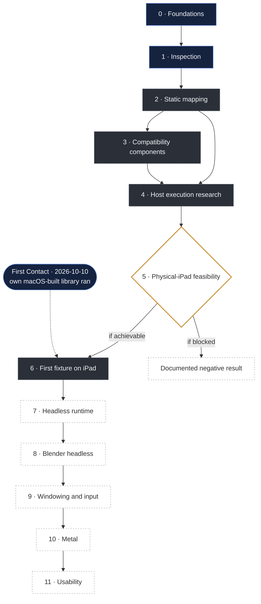

# MacBridge roadmap

This is a research plan, not a release schedule. It describes how MacBridge intends to get from where it is
to its long-term target, what each step must demonstrate, and what could stop it.

There are no dates and no percentages. A phase ends when its defining result has been recorded, positive or
negative. A precise "blocked by X" is a valid way for a phase to end.

**Contents:** [Vision](#vision) · [Status vocabulary](#status-vocabulary) · [At a glance](#at-a-glance) ·
[Dependencies](#dependencies) · [Phases](#phases) · [Research risks](#research-risks) ·
[Next sessions](#next-sessions)

---

## Vision

> Run the official, unmodified ARM64 macOS build of Blender locally on an Apple Silicon iPad, through an
> original userspace compatibility layer, within the platform's rules.

Blender is the North Star because it needs almost everything a Mac app can need. It is a direction for the
research. Reaching it is not assumed. See [Blender research](docs/research/blender.md).

## Status vocabulary

| Status | Meaning |
|---|---|
| **COMPLETE** | The phase's defining result is recorded. It means the *research milestone* is done, not that a product feature is supported. |
| **EXPERIMENTAL** | Working research code or models exist and pass their checks, but not yet in the environment that matters (usually a physical iPad). |
| **ACTIVE** | Current work. |
| **BLOCKED** | Cannot proceed. The obstacle is named. |
| **NOT STARTED** | No work yet, usually because an earlier phase must finish first. |
| **UNKNOWN** | Whether this phase is achievable at all depends on an unanswered question. |

## At a glance

| Phase | | Status |
|---|---|---|
| 0 | Research foundations | **COMPLETE** |
| 1 | Inspection | **COMPLETE**, including on a physical iPad |
| 2 | Static compatibility mapping | **ACTIVE**, nearly complete for Blender 5.2.2 headless |
| 3 | Original compatibility components | **EXPERIMENTAL**, Mac and simulator only |
| 4 | Host execution research | **EXPERIMENTAL**, Intel Mac; the same loader steps also measured on the iPad |
| 5 | Physical-iPad feasibility | **ACTIVE**, first positive result: own same-team-signed libraries run under development signing ([First Contact](docs/research/first-contact.md)) |
| 6 | First ARM64 macOS fixture on an iPad | **ACTIVE**, a macOS-built test *library* has run; a standalone program has not |
| 7 | Headless runtime | NOT STARTED |
| 8 | Blender headless | NOT STARTED |
| 9 | Windowing and input | NOT STARTED, static mapping only |
| 10 | Metal | NOT STARTED |
| 11 | Usability and reliability | NOT STARTED |

## Dependencies

The phases are numbered in the order they are expected to happen, but they are not a straight line. Phase 5
is a gate: its answer decides whether phases 6 to 11 are possible on a stock iPad at all.

Navy: complete, or a recorded milestone. Graphite, dashed: active or experimental. Amber: the gate.
Dotted: not started.

Four tracks run alongside every phase:

- **Testing.** Every subsystem is checked against an independent reference (Apple's tools, LLVM, Apple's
  own loader running MacBridge's fixtures) before it is trusted.
- **Security.** No step may require bypassing a platform protection. If one does, it is recorded as blocked.
- **Evidence.** Every result names its environment, and results are never copied between environments.
- **Documentation.** Findings that are safe to publish land in this repository.

---

## Phases

### Phase 0 · Research foundations

| | |
|---|---|
| **Goal** | Define the question, the boundaries and the first architecture decisions. |
| **Status** | COMPLETE (2026-10-01) |
| **Result** | Native ARM64 first; no full virtual machine as the primary design; a userspace runtime inside one app; Apple's proprietary files never redistributed; no code imported from GPL projects. |

### Phase 1 · Inspection

| | |
|---|---|
| **Goal** | Understand macOS software without running it. |
| **Status** | COMPLETE. The inspector app was installed and used on a physical iPad Air (M3), iPadOS 27.0. |
| **Evidence required** | Inspector results on the Mac and on a physical iPad; tests over original fixtures. |
| **Success criteria** | Thin and universal Mach-O, load commands, signatures and entitlements, nested executables, bundles and dependency graphs are read correctly; a report explains its findings with reasons, never a score. |
| **Follow-up** | The reliability fixes found by fuzzing (2026-10-09) have to be built and tested on a Mac, then reach the app. |

### Phase 2 · Static compatibility mapping

| | |
|---|---|
| **Goal** | Know exactly what a headless start of Blender asks of the system, and who could answer each request on an iPad. |
| **Status** | ACTIVE, nearly complete for the canonical Blender 5.2.2 build. |
| **Done so far** | Canonical build identity; every library and symbol attributed; 1,453 imports routed; 26 system library links mapped; fixups decoded identically to LLVM; Objective-C classes parsed; process-state requests identified; per-capability preflight. |
| **Evidence required** | Each requirement either mapped to a measured answer or to a named blocker. |
| **Success criteria** | No requirement of a headless start remains unclassified. |
| **Open items** | The `NSColor` conflict needs an owner decision. Python resource experiments for the canonical build need an Apple Silicon Mac. |

### Phase 3 · Original compatibility components

| | |
|---|---|
| **Goal** | Build the smallest original pieces a Mac program needs just to load, and validate them with original fixtures. |
| **Status** | EXPERIMENTAL. |
| **Done so far** | A load surface for the 47 definitions Blender needs to load, validated on an Intel Mac and in the x86_64 iOS Simulator; an omission sweep shows each is required. |
| **Prerequisites** | Phase 2. |
| **Evidence required** | Own fixtures that load with the component and fail without it, on the Mac, in the simulator and, later, on the iPad. |
| **Success criteria** | The load-time surface works on a physical iPad with own fixtures. |
| **Blockers** | Phase 5. The `NSColor` decision. |

### Phase 4 · Host execution research

| | |
|---|---|
| **Goal** | Turn the checked models into a working loader, on a Mac, for MacBridge's own fixtures. |
| **Status** | EXPERIMENTAL. Done on an Intel Mac with x86_64 builds; the research branch with the cloud reliability fixes is built and tested there (485 tests). |
| **Done so far** | Mapping, fixups (memory identical to the model), multi-library linking with weak coalescing, thread-local variables, Objective-C registration, initializers, calls. ARM64 thread-local entry code passes its contract under an emulator and, since 2026-10-10, on a physical iPad. |
| **Evidence required** | The same results with ARM64 builds on an Apple Silicon Mac. |
| **Success criteria** | The research loader runs every own fixture on ARM64 macOS, with memory matching the model. |
| **Blockers** | None technical. Needs an Apple Silicon Mac session. |
| **Next experiment** | Run the loader's test suite with ARM64 builds on an Apple Silicon Mac. |

### Phase 5 · Physical-iPad feasibility

| | |
|---|---|
| **Goal** | Measure what an iPad app may legitimately do with its own signed code, and whether MacBridge's loader can work within that. |
| **Status** | ACTIVE. **First positive, narrow result (2026-10-10).** On an iPad Air 11-inch (M3), iPadOS 27.0, a development build of DeviceProbe measured memory, file limits and Apple's loader, and MacBridge's loader ran MacBridge's own ARM64 test libraries, signed by the app's team, including one built for macOS. Each group ran twice. See [First Contact](docs/research/first-contact.md). |
| **Answered so far** | Page size 16 KiB; about 5.36 GB (4.99 GiB) available to a small app; open-file limit 256, raisable to 10,240; Apple's loader refuses the macOS build; MacBridge's loader maps, fixes up, initializes and calls own same-team-signed libraries. |
| **Still open** | Code signed by another team (Blender's case); distribution signing (App Store, TestFlight) without `get-task-allow`; what the successful anonymous-memory call allows (nothing was run from it: UNKNOWN); the memory a real workload can use. |
| **Prerequisites** | Phase 4's results on an Intel Mac (they exist). Phase 4's ARM64 criterion is not required to *measure*, but the probe's loader must be built for ARM64, which happens on a Mac. |
| **Evidence required** | DeviceProbe's recorded results on a named iPad model and iPadOS build. |
| **Success criteria** | Each question has a measured answer: memory limit, file limit, executable-memory policy, system-loader control, MacBridge's loader on its own signed library. |
| **Blockers** | None for MacBridge's own code. The open questions above need new builds and, for another team's signature, a test library signed by a different team. |
| **What it decides** | Whether phases 6 to 11 are possible on a stock iPad. For MacBridge's own code under development signing the answer is now yes; for anyone else's code it is still open. See [DeviceProbe](docs/research/device-probe.md). |

### Phase 6 · First ARM64 macOS fixture on an iPad

| | |
|---|---|
| **Goal** | A small, original ARM64 macOS program runs on a physical iPad through MacBridge, with its output recorded. |
| **Status** | ACTIVE. **A macOS-built ARM64 test library has executed on a physical iPad through MacBridge (2026-10-10)**: MacBridge's own code, same-team signature, development build. **A standalone macOS program (`MH_EXECUTE`) has not.** |
| **Prerequisites** | Phase 5 shows a legitimate route. Shown for own same-team-signed code under development signing. |
| **Evidence required** | Output captured on a named device and iPadOS build. |
| **Success criteria** | A "hello world", then programs that use files, threads and Foundation, run and exit cleanly. |
| **Done so far** | A macOS-built test library ran (First Contact); Objective-C classes of a macOS-built test library were registered and their methods ran (2026-10-10). |
| **Next steps, in order** | Several dependent test libraries with symbol resolution · a first minimal own `MH_EXECUTE` (**deferred** pending an owner security and feasibility review) · distribution signing · another team's signature. |
| **Main blocker** | For MacBridge's own code: none measured so far. For code signed by someone else, such as Blender: whether it can legitimately become executable inside MacBridge's process, untested. |

The first executed macOS-built library is a real step. It is not yet the program-level result this phase
is defined by.

### Phase 7 · Headless runtime

| | |
|---|---|
| **Goal** | Give a loaded program the process it expects: arguments, environment, working directory, bundle, files, threads, time, resources. |
| **Status** | NOT STARTED. A model of the file layout exists. |
| **Prerequisites** | Phase 6. |
| **Success criteria** | Own fixtures that query their process, read and write files and run threads behave on the iPad as they do on the Mac. |
| **Main blocker** | The program shares MacBridge's process. Every answer about "the current process" has to be provided by MacBridge on the program's behalf. |

### Phase 8 · Blender headless

| | |
|---|---|
| **Goal** | The official Blender ARM64 build reaches its own code and does useful work without a window. |
| **Status** | NOT STARTED. |
| **Prerequisites** | Phase 7. |
| **Stages** | Each shown separately: `--version` prints · a Python script runs · a `.blend` file opens and saves · Cycles renders on the CPU and writes an image. |
| **Evidence required** | Each stage on a named device and build, compared with the Mac reference runs. |
| **Main blockers** | Memory; Python's native modules loaded at run time; thousands of initializers; Blender's own code signature. |

### Phase 9 · Windowing and input

| | |
|---|---|
| **Goal** | A Mac window becomes something on the iPad screen; touch, keyboard and trackpad become the events a Mac app expects. |
| **Status** | NOT STARTED. Blender's windowing and input requirements are mapped on paper. |
| **Prerequisites** | Phase 8. |
| **Main blocker** | AppKit's behaviour, not just its structure, would have to exist. This is a large surface. |

### Phase 10 · Metal

| | |
|---|---|
| **Goal** | GPU drawing and rendering through the iPad's GPU. |
| **Status** | NOT STARTED. Every Metal function Blender calls exists on iPadOS by name; its behaviour is unknown. |
| **Prerequisites** | Phase 9. |
| **Success criteria** | Blender's viewport draws and Cycles renders on the GPU. |

### Phase 11 · Usability and reliability

| | |
|---|---|
| **Goal** | A stable experimental experience, if every earlier barrier has been overcome. |
| **Status** | NOT STARTED. |

---

## Research risks

More code cannot remove an operating-system rule. These are the questions that could stop the project or
change its shape. They are listed so nobody has to guess.

| Risk | Why it matters | What would tell us |
|---|---|---|
| **Executable memory and code signing** | iPadOS runs code that is signed into the app. MacBridge's own macOS-built library, signed by the app's team, ran under development signing. Code signed by another developer, and distribution builds, are untested; if they can never be in that position legitimately, Blender cannot run on a stock iPad. | Phase 5, then 6. |
| **One process** | An iPad app cannot start a separate process, so the Mac program would live inside MacBridge. Anything that assumes it owns the process has to be answered by MacBridge. | Phase 7. |
| **Memory limits** | Blender used 350 to 373 MiB for small CPU renders on a Mac. A small app on the iPad Air (M3) had about 5.36 GB (4.99 GiB) available; what a large workload can actually use is unmeasured. | Phases 5 and 8. |
| **Same name, different behaviour** | 1,368 of Blender's imports exist on iPadOS by name. None has been shown to behave the same for a Mac program. | Phases 6 to 8. |
| **Objective-C collisions** | One process, one class namespace. `NSColor` already collides. | Phase 3 and the owner's decision. |
| **Missing system services** | Some macOS libraries have no iPadOS equivalent at all (AppKit, Carbon, OpenGL). | Phases 8 and 9. |
| **Windowing semantics** | Mac windows and iPad scenes work differently. | Phase 9. |
| **Metal semantics** | Same API names, different devices and drivers. | Phase 10. |

## Next sessions

What each kind of environment can do next. Cloud sessions have no Mac and no iPad, so they are listed
separately.

| Environment | Next work |
|---|---|
| **Cloud** | Documentation; fuzzing; execution-free models that need no Apple tools, such as how Blender finds its Python resources, and a load-time routing table. |
| **Intel Mac** | Build the next DeviceProbe groups; keep the full suite green. |
| **Apple Silicon Mac** | Build and run the research loader with ARM64 fixtures; Python resource experiments on the canonical Blender build. |
| **Physical iPad** | In order: several dependent test libraries; a first minimal own `MH_EXECUTE` (deferred until the owner's review); a distribution-signed build; a test library signed by another team. Then larger runtime services, and eventually a headless Blender start. |
| **Owner decision** | Whether and when to merge the research branch. The `NSColor` approach. |
