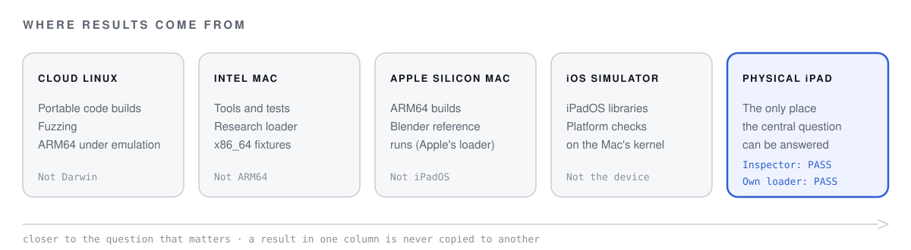

# MacBridge status

*Last updated: 2026-10-09*

MacBridge can **inspect** macOS apps, including on a physical iPad, and **model** what running them would
require. It has research code that loads and runs MacBridge's own test libraries **on a Mac**.
It **does not run macOS software on an iPad**, and Blender has not run through MacBridge on any device.

Every result below names the environment it was measured in. Definitions of the labels are in
[How results are established](docs/evidence.md).

**Contents:** [Dashboard](#dashboard) · [By environment](#by-environment) · [Blender readiness](#blender-readiness) ·
[Tests](#tests) · [Recent changes](#recent-changes) · [Next](#next)

---

## Dashboard

### Working

| Result | Where |
|---|---|
| Inspector app: imports and inspects Mac apps, exports reports | Physical iPad Air 11-inch (M3), iPadOS 27.0 · iOS Simulator · Mac command line |
| Mach-O, bundles, signatures, entitlements, nested executables, dependency graphs | Mac and iPad app |
| Released as `v0.1.0-alpha` (pre-release in the private development repository; inspector only) | — |

### Experimentally demonstrated

| Result | Where | Limits |
|---|---|---|
| Research loader maps, fixes up, links, initializes and calls MacBridge's own test libraries; memory after fixups matches the model byte for byte | Intel Mac, x86_64 | Own fixtures only. Not ARM64 on a Mac, not on an iPad, never Blender. |
| Weak-symbol coalescing across several libraries, thread-local variables, Objective-C class registration through the documented runtime API | Intel Mac, x86_64 | Same. |
| Load surface for the 47 definitions Blender needs to load (39 from AppKit); removing each in turn stopped loading (44 of 44 cases) | Intel Mac and x86_64 iOS Simulator, own fixtures | Structure only, not behaviour. Never tested with Blender. |
| ARM64 thread-local entry code keeps its register contract on four threads | Cloud Linux, under the QEMU emulator | Emulated; not Darwin, not Apple hardware. |

### Under investigation

| Question | State |
|---|---|
| What can an iPad app do with its own signed test library? | An early build of DeviceProbe is installed on the iPad. **Not yet run**, so no result. The version that will run is on a research branch and must be built and reinstalled first. |
| How should `NSColor` be handled when UIKit already defines it? | Options measured in the x86_64 iOS Simulator; **owner decision pending**. |
| Do the reliability fixes from the 2026-10-09 cloud session build and pass on a Mac? | On a research branch; **not yet built on a Mac**. |

### Not yet demonstrated

| | |
|---|---|
| Any macOS binary running through MacBridge on a physical iPad | **Not demonstrated** |
| The research loader on ARM64 macOS or on an iPad | **Not demonstrated** |
| Blender through MacBridge, at any stage, on any device | **Not demonstrated** |

### Blocked or unknown

| | State | Why |
|---|---|---|
| Running a Mac program as a separate process on iPad | **BLOCKED** | An iPad app cannot start other programs as processes. A Mac program would have to run inside MacBridge's own process. |
| Executable memory for a Mac program's code on iPad | **UNKNOWN** | iPadOS runs code signed into the app. Whether code that began as a Mac program can legitimately be in that position is the project's decisive open question. |
| The iPad's memory limit for this workload | **UNKNOWN** | Not measured yet. |

---

## By environment

The same question can have a different answer in each environment. These are kept apart and never copied
from one column to another. "—" means no recorded result: NOT TESTED there.

| | Cloud Linux | Intel Mac | Apple Silicon Mac | iOS Simulator | Physical iPad |
|---|---|---|---|---|---|
| Inspector | tests pass (portable subset) | tests pass | — | PASS | **PASS** |
| Research loader, own x86_64 fixtures | — | **PASS** | — | — | — |
| Research loader, own ARM64 fixtures | thread-local entry code only, emulated | — | — | — | — |
| AppKit load surface, own fixtures | — | **PASS** | — | **PASS** | — |
| DeviceProbe | — | — | — | — | NOT TESTED (early build installed) |
| Blender run normally (Apple's loader, reference only) | — | **PASS** (4.5.13) | **PASS** (5.2.2) | — | — |
| Blender through MacBridge | — | — | — | — | — |

  <picture>
    <source media="(prefers-color-scheme: dark)" srcset="media/environments-dark.svg">
    <source media="(prefers-color-scheme: light)" srcset="media/environments-light.svg">
    
  </picture>

## Blender readiness

All static analysis of the official Blender 5.2.2 ARM64 build, or Blender run normally on a Mac. **None of
it is Blender running through MacBridge.** Details: [Blender research](docs/research/blender.md).

- **Startup closure.** A headless start loads 30 native images, about 592 MiB of virtual memory, with 6,211
  static initializers. Every image uses bind opcodes, not chained fixups.
- **Fixups.** MacBridge's decoder matches LLVM's `llvm-objdump` on all 195 images that carry fixups:
  1,201,316 fixups.
- **Libraries.** 26 macOS system libraries are linked, all strongly. 14 need a redirect to an iPadOS
  library; Cocoa, OpenGL and AudioUnit need stand-ins; AppKit is a provider conflict.
- **Symbols.** 1,453 imported system symbols: 1,368 exist on iPadOS by name, 46 would come from MacBridge,
  38 are unresolved lazily bound functions, 1 is a conflict (`NSColor`). Existing by name is not behaving
  the same.
- **Process state.** 49 functions and 11 Objective-C messages exist on iPadOS by name but describe or
  control the process itself. MacBridge would have to answer them for a loaded program. None is
  implemented.
- **Preflight.** 23 capabilities: PASS 5, PARTIAL 8, UNKNOWN 5, NOT TESTED 3, BLOCKED 2. No overall verdict.
- **Reference runs.** Run normally on an Apple Silicon CI runner, Blender 5.2.2 printed its version (121 MiB peak),
  ran Python, rendered a small image with Cycles on the CPU, saved, reopened and rendered the file again. The
  29 bundled libraries it loaded were exactly the ones predicted.

## Tests

Different suites in different environments. They are not added together.

| Suite | Environment | Result | Date | Branch |
|---|---|---|---|---|
| Full Swift test suite | Intel Mac, macOS 26.5.2 | 469 passed, 0 failed | 2026-10-08 | Main development branch |
| Portable subset | Cloud Linux, Swift 6.3.2 | 405 passed | 2026-10-09 | Research branch, not merged, not yet built on a Mac |

## Recent changes

**2026-10-09**

- Coverage-guided fuzzing found and fixed three defects that a crafted file could trigger in the
  inspector's decoders: two crashes and one severe slowdown. Each has a reproducer and a regression test.
  A 20-minute re-run of the inspection fuzzer (286,237 runs) found no crash and no timeout; it showed one of
  the same inputs was still slow in a library model the app does not use, which was fixed as well. The
  fixes are on a research branch and have not yet been built on a Mac, so they are not in the app yet.
- The ZIP importer was fuzzed for path escapes: none found in over 600,000 runs.
- The portable part of the project builds and passes its tests on Linux (405 tests).
- ARM64 thread-local entry code validated under an emulator.
- This documentation was rebuilt. One public wording error was corrected: the load surface covers 47
  definitions, of which 39 are AppKit's, not "47 AppKit definitions". See
  [corrections](docs/evidence.md#corrections).

**2026-10-08**

- The research loader ran MacBridge's own test libraries on an Intel Mac, in four steps.
- An early build of DeviceProbe was installed on the iPad (not run).
- Blender 5.2.2's headless requirements were mapped symbol by symbol.

The full history is in the [research journal](docs/journal.md).

## Next

1. On a Mac: build and test the research branch, then merge it if everything passes.
2. On the iPad: rebuild and reinstall DeviceProbe from the research branch, run it, and publish its results
   with the device model and iPadOS build.
3. Owner decision: `NSColor`.

The dependency-ordered plan is in [ROADMAP.md](ROADMAP.md).
