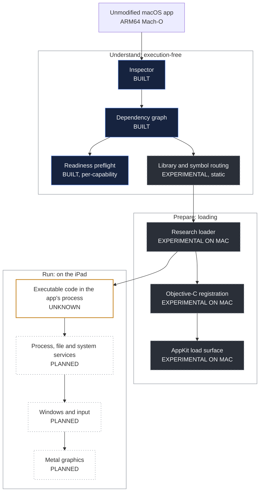

# Architecture

MacBridge is designed as a **userspace runtime inside one ordinary iPad app**. There is no virtual
machine, no second operating system, no remote Mac and no change to iPadOS. The app would read a macOS
program, prepare it the way macOS's loader would, route its requests for system services to iPadOS or to
MacBridge's own replacements, and run it inside the app's own process.

Most of that does not exist yet. This page separates what is built from what is designed, subsystem by
subsystem.

## Status labels

| Label | Meaning |
|---|---|
| **BUILT** | Implemented and tested, including on a physical iPad where stated. |
| **EXPERIMENTAL ON MAC** | Research code or models validated on a Mac, in the iOS Simulator or statically. Not on an iPad. |
| **PLANNED** | Designed or described, not implemented. |
| **UNKNOWN / BLOCKED** | Depends on a question nobody has answered yet, or on a known obstacle. |

## Overview

Navy: built. Graphite, dashed: experimental, not on an iPad. Outline, dotted: planned. Amber outline:
unknown, and everything below it depends on the answer.

The diagram reads top to bottom, but the dependency that matters most is in the middle. Everything in
"Run" depends on one open question: whether code that came from a Mac program can legitimately become
executable inside an iPad app's process. If the answer is no, the lower half of this diagram cannot be
built on a stock iPad, and that will be published as the result.

---

## Subsystems

### Inspector

| | |
|---|---|
| **Purpose** | Read macOS software without running it. |
| **Status** | BUILT. Released internally as `v0.1.0-alpha`. |
| **Evidence** | Used on a physical iPad Air (M3) running iPadOS 27.0; also on the Mac command line and in the iOS Simulator. |
| **Covers** | Thin and universal Mach-O (arm64, arm64e, x86_64), all load commands, code signatures and entitlements, nested helpers, XPC services and extensions, `.app` bundles and zipped bundles. |
| **Limits** | Inspection only. It produces a rule-based report with reasons, never a score, and executes nothing. |
| **Next** | Ship the reliability fixes found by fuzzing once they are built and tested on a Mac. |

### Dependency graph

| | |
|---|---|
| **Purpose** | Find every library a program will bring into memory, bundled or system. |
| **Status** | BUILT. |
| **Evidence** | For Blender 5.2.2, the predicted set of bundled libraries matched the libraries actually loaded when Blender ran normally on an Apple Silicon CI runner: 29 of 29. |
| **Limits** | Libraries loaded later by name, such as Python extension modules, are found by inventory rather than by the graph. |

### Readiness preflight

| | |
|---|---|
| **Purpose** | Answer "what would a headless start of this program need?", one capability at a time. |
| **Status** | BUILT, for the canonical Blender 5.2.2 build. |
| **Evidence** | 23 rows, each with its own status, evidence kind and environment: PASS 5, PARTIAL 8, UNKNOWN 5, NOT TESTED 3, BLOCKED 2. |
| **Limits** | There is no overall verdict, on purpose. A PASS row is a necessary condition, not evidence that Blender runs. |

### Library and symbol routing

| | |
|---|---|
| **Purpose** | Decide, for every library and symbol a program imports, who provides it on an iPad. |
| **Status** | EXPERIMENTAL, static. The routing table exists; nothing applies it at load time yet. |
| **Evidence** | All 1,453 imports of a headless Blender start are assigned: 1,368 to iPadOS by name, 46 to MacBridge, 38 unresolved and only lazily bound, 1 conflict. All 26 system library links are assigned. |
| **Limits** | "Exists on iPadOS by name" says nothing about behaviour. 49 imports exist by name but act on the process itself (its identity, its loader state, starting processes), so MacBridge would have to provide them. None is implemented. |
| **Next** | A load-time resolver that applies the table. |

### Research loader

| | |
|---|---|
| **Purpose** | Do what macOS's loader does, for a program that macOS's loader will not be there to load. |
| **Status** | EXPERIMENTAL ON MAC. |
| **Evidence** | On an Intel Mac, with MacBridge's own x86_64 test libraries: maps them, applies fixups, links several together with weak-symbol coalescing, sets up thread-local variables, registers Objective-C classes, runs initializers and calls their functions. ARM64 thread-local entry code passed its contract under an emulator on Linux. |
| **Limits** | Own fixtures only. Not built for ARM64 Darwin, not run on an iPad, never run on Blender. |
| **Next** | Build and test on a Mac, then measure on the iPad with DeviceProbe. See [The experimental loader](research/loader.md). |

### Objective-C registration and the AppKit load surface

| | |
|---|---|
| **Purpose** | Make the Objective-C classes a Mac program expects exist, through Apple's documented runtime API. |
| **Status** | EXPERIMENTAL ON MAC. |
| **Evidence** | The 47 macOS definitions Blender needs to load (39 of them AppKit's) are provided to MacBridge's own fixtures on an Intel Mac and in the x86_64 iOS Simulator. Removing each in turn stops loading (44 of 44 cases). The research loader registers its own test classes through the documented API on an Intel Mac, and refuses a class name that already exists. |
| **Limits** | Structure, not behaviour: these classes let a program load; they do not draw windows. `NSColor` collides with a UIKit class of the same name, and that decision is open. See [Objective-C research](research/objective-c.md). |

### Executable code on the iPad

| | |
|---|---|
| **Purpose** | Run the loaded program's instructions inside MacBridge's process. |
| **Status** | UNKNOWN. |
| **Evidence** | iPadOS runs code signed into the app. General executable memory is documented by Apple only for alternative browser engines. Nothing has been measured on a device yet. |
| **Next** | [DeviceProbe](research/device-probe.md): measure what an app may do with its *own* signed test library. |

### Process, file and system services

| | |
|---|---|
| **Purpose** | Give a loaded Mac program the process it expects: arguments, environment, working directory, bundle, temporary files, a Mac-like file layout. |
| **Status** | PLANNED. A model of the file layout exists: every path Blender used in its Mac reference runs resolves in it, with a temporary directory set to `/tmp`. |
| **Limits** | An iPad app cannot start a separate process, so the program would share MacBridge's process. That is one of the two blocked rows of the preflight. |

### Windows, input and Metal

| | |
|---|---|
| **Purpose** | Turn a Mac window into something on the iPad screen; turn touch, keyboard and trackpad into the events a Mac app expects; let its Metal rendering reach the iPad's GPU. |
| **Status** | PLANNED. Static research only: Blender's windowing, input and graphics surface has been mapped to iPadOS counterparts on paper. Every Metal function Blender calls also exists on iPadOS by name; how it behaves is unknown. |
| **Next** | Nothing, until headless execution exists. |

---

## Principles

- **Original code only.** MacBridge does not include Apple's code, Blender's code, or code from other
  compatibility projects. Its test programs are written for it.
- **Documented interfaces.** Objective-C classes are registered through the documented runtime API. No
  undocumented private API is used without being identified and isolated.
- **No bypass.** If a step requires defeating code signing, the sandbox or any other protection, the step
  is recorded as blocked. See [SECURITY.md](../SECURITY.md).
- **Execution-free first.** Every part that can be checked without running anything is built and checked
  that way first, against Apple's own tools, before any execution experiment.
