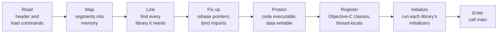

# The experimental loader

Before a program's first instruction runs, a lot has already happened. On a Mac, Apple's dynamic loader
does that work. A Mac program arriving on an iPad through MacBridge would have no macOS loader, so
MacBridge needs its own. This page explains what a loader does, what MacBridge's research loader has
demonstrated, and, just as precisely, what it has not.

## What a loader does

Loading is everything between "here is a file" and "call `main`":

Each step can fail on its own, and many failures happen before the program's own code has a chance to run.
That is why loading is studied separately from execution: a program that cannot be loaded never gets to
show whether it would have worked.

## Why fixups matter

A program is linked as if it would load at a fixed address and as if every library it needs were at a known
place. Neither is true. The loader corrects every pointer (*rebasing*) and fills in the address of every
imported symbol (*binding*). Blender's headless start has about 1.2 million such fixups.

A single wrong fixup does not usually fail loudly. It leaves a pointer that is almost right, and the program
crashes much later, somewhere unrelated. So MacBridge checks fixups in two independent ways:

- **Against LLVM.** MacBridge's decoder reads the fixup information of all 195 of Blender's images that
  have any and produces exactly the same list as LLVM's `llvm-objdump`: 1,201,316 fixups.
- **Against Apple's loader.** An execution-free model computes what memory should look like after loading.
  For MacBridge's own probe program, it reproduces every value Apple's loader wrote, on the Mac and in the
  simulator.

## Why initializers matter

Libraries run code when they load. Blender's headless start has 6,211 static initializers spread across 30
images, most of them in one large library. They have to run in the right order, after every fixup, and each
one assumes that the libraries it depends on have already been initialized.

MacBridge's model of that order (depth-first, dependencies first, Objective-C `+load` methods before C++
constructors) was checked against Apple's loader with MacBridge's own test libraries.

## Why MacBridge's own test libraries matter

It would be tempting to point the loader at Blender immediately. It would also teach very little: Blender
would fail somewhere, for one of hundreds of reasons, and the failure would not say which.

Instead MacBridge uses small original C, C++ and Objective-C libraries, each designed so that **one result
depends on exactly one loader step**. If thread-local variables are set up wrong, one specific number comes
out wrong. If an initializer did not run, a counter reads zero.

That design paid off early. A first version of one test "passed" its initializer check without any
initializer running: the compiler had computed the value ahead of time. The fixture was rewritten so that
the value can only come from an initializer that calls through a bound pointer, and the check now fails if
either step is skipped.

## What has been demonstrated

On an **Intel Mac**, with **x86_64 builds of MacBridge's own test libraries**, the research loader:

| Step | Result |
|---|---|
| Maps a library into memory from its file | PASS |
| Applies rebases, binds and lazy binds | PASS: memory matches the model byte for byte, checked before any initializer runs |
| Links several libraries, including weak-symbol coalescing across them | PASS |
| Sets up thread-local variables through MacBridge's own allocator | PASS |
| Registers Objective-C classes through Apple's documented runtime API | PASS; a class name that already exists is refused |
| Runs initializers, then calls exported functions | PASS |

On **Cloud Linux, under the QEMU emulator**, the ARM64 version of the thread-local entry code, with
MacBridge's real allocator behind it, kept every register it must keep, on four threads at once. Three
deliberately broken variants were each caught.

## What has not been demonstrated

- The loader has not been built or run for ARM64 on a Mac.
- It has not run on an iPad.
- It has never been pointed at Blender, or at any program that is not MacBridge's own.
- The emulator result shows the ARM64 instructions are right. It does not show that macOS or iPadOS would
  accept them.

## The next question

On a Mac, the research loader can map its test libraries executable because macOS allows that for the
process it runs in. On an iPad, the rules are different and stricter. The next experiment,
[DeviceProbe](device-probe.md), asks the loader to do the same thing on a physical iPad with a test library
that is signed into the app the normal way, and records exactly what the system allows. It changes no
security setting and works around nothing.

---

Related: [Technical concepts](../concepts.md#loading) · [Architecture](../architecture.md#research-loader) ·
[How results are established](../evidence.md)
